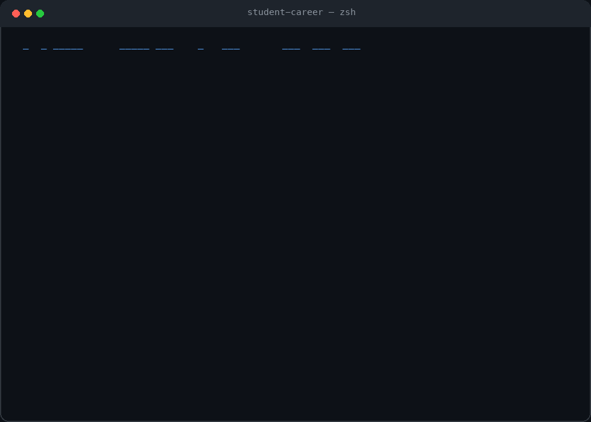

# newgrad-ops

[](LICENSE)
[](CONTRIBUTING.md)
[](AGENTS.md)

**Career-Ops for students trying to get their first tech offer.**

Turn Claude Code, Codex, Gemini CLI, Cursor, or any AI coding assistant into an internship and new-grad job-search command center.

Track applications · tailor resumes · prep for online assessments · grind company-specific LeetCode · audit your GitHub portfolio · manage referrals · build a weekly recruiting plan.

Not another job tracker — an agentic career operating system for breaking into tech.



---

## One student journey

```bash
/student company anthropic
/student tailor-resume https://anthropic.com/careers/software-engineer
/student interview weak-patterns
/student portfolio-audit
/student alumni-message anthropic
```

Output:

```
────────────────────────────────────────────────────────────
Anthropic New-Grad Prep Pack

APPLICATION
  Resume focus: Python + reliability signals, AI tooling projects
  Fit tip: reframe projects toward evals and observability

INTERVIEW FORMAT (from anthropic.com/careers)
  Tools: Colab · CodeSignal
  Lookups: allowed, but be fluent in syntax
  AI usage: only when explicitly permitted

OA PREP
  Focus: Sliding Window · Graphs · DP
  Problems: Longest Substring · Course Schedule · Word Break

BEHAVIORAL
  Themes: ownership · judgment · mission alignment
  Stories: shipped without requirements · debugged the unknown · disagreed productively

WEEKLY PLAN
  Mon: 5 sliding window problems
  Tue: resume tailoring pass (Anthropic)
  Wed: 5 graph problems
  Thu: mock CodeSignal session (45 min, plain Python)
  Fri: alumni outreach × 2

────────────────────────────────────────────────────────────
```

---

## Modules

| Module | Commands | What it does |
|--------|----------|-------------|
| **Apply Ops** | `/student apply-plan`, `fit-score`, `tailor-resume`, `track`, `follow-up` | Application planning, fit scoring, resume diffs, tracking |
| **Interview Ops** | `/student interview diagnose`, `weak-patterns`, `review-today`, `explain-with-links` | Pattern diagnosis, spaced review, company problems |
| **Company Ops** | `/student company <name>` | Full prep pack: format, OA patterns, behavioral, weekly plan |
| **Portfolio Ops** | `/student portfolio-audit`, `github-readme`, `project-match`, `project-upgrade-plan` | GitHub audit, README upgrades, project-role matching |
| **Referral Ops** | `/student referral-map`, `alumni-message`, `recruiter-dm`, `follow-up-referral` | Alumni connections, ethical outreach drafts |

---

## Problem lists

Three curated lists for structured interview prep:

| List | Problems | Source |
|------|----------|--------|
| **NeetCode 150** | 150 problems, 16 patterns | [neetcode.io](https://neetcode.io/practice) — free video explanations |
| **Blind 75** | 76 problems (highest-frequency) | [neetcode.io](https://neetcode.io/practice) |
| **Monster 50** | 50 highest-ROI problems, 12 categories | [algo.monster/practice](https://algo.monster/practice) — organized by cue and trap |

All three are mapped in `data/interview/` with patterns, traps, and public solution links.

---

## Quick start

**1. Clone the repo**
```bash
git clone https://github.com/[you]/newgrad-ops.git
```

**2. Point your AI CLI at the skills directory**

For Claude Code:
```bash
# In your CLAUDE.md or via /config, add the skills path:
# skills_dir: ./skills
claude
/student company anthropic
```

For Codex CLI:
```bash
codex --skills-dir ./skills
```

For Cursor: add `skills/student-career/SKILL.md` to your context.

**3. Use the scripts locally**
```bash
python scripts/score_resume.py my-resume.md
python scripts/score_readme.py ~/projects/my-project/README.md
python scripts/generate_review_schedule.py solved.json
python scripts/search_problems.py --pattern "Graphs" --difficulty Medium
```

---

## Company prep packs

Built-in coverage for:
- [Anthropic](data/companies/anthropic.md) — live escalating challenge (Colab/CodeSignal), AI usage policy
- [OpenAI](data/companies/openai.md) — practical/debugging style, not blank-file LeetCode
- [Google](data/companies/google.md) — Google Docs coding, no IDE, classic LeetCode-style
- [Meta](data/companies/meta.md) — formerly Facebook — speed-focused, classic LeetCode-style
- [Amazon](data/companies/amazon.md) — classic LeetCode-style + Leadership Principles as their own bar
- [Microsoft](data/companies/microsoft.md) — classic LeetCode-style with a behavioral warm-up each round
- [Apple](data/companies/apple.md) — DP/sliding-window take-home filter, memory/defensive-coding emphasis
- [Netflix](data/companies/netflix.md) — behavioral weighted heaviest of any company here, coding weighted least
- [Stripe](data/companies/stripe.md) — take-home projects, code quality focus, not LeetCode-style

Each file states its `Coding style` explicitly — some of these companies don't run a LeetCode-style interview at all, and treating every "coding interview" the same way is the fastest way to over- or under-prep.

Add your own: create `data/companies/<name>.md` following the same template (see [CONTRIBUTING.md](CONTRIBUTING.md)).

---

## Safety principles

- **No auto-apply** — all applications are reviewed and submitted by you
- **No auto-email** — all outreach messages are drafts; you send them manually
- **No scraped paid content** — links go to public pages only (NeetCode free, AlgoMonster free tier, LeetCode problem statements)
- **No fake referrals** — referral templates are ethical, one-at-a-time, manually sent
- **No destructive file writes** — scripts print to stdout; nothing is written without your intent
- **Company prep packs cite public sources** — interview format data comes from public careers pages

---

## Examples

See the `examples/` directory for realistic sample outputs:

- [`anthropic-prep-pack.md`](examples/anthropic-prep-pack.md) — full company prep pack
- [`new-grad-application-plan.md`](examples/new-grad-application-plan.md) — weekly application plan
- [`weak-pattern-report.md`](examples/weak-pattern-report.md) — pattern coverage and drill list
- [`portfolio-audit.md`](examples/portfolio-audit.md) — before/after GitHub audit

---

## Contributing

See [CONTRIBUTING.md](CONTRIBUTING.md) for the full guide, ground rules, and a list of good first issues (the Blind 75 and NeetCode 150 maps both have known gaps — easy, well-scoped PRs).

Quick version: to add a company pack, create `data/companies/<name>.md` using the existing files as a template and cite only public sources. To add problems to the maps, edit the JSON files in `data/interview/` — include pattern, difficulty, a verified public URL, and at least one trap.

By participating you agree to the [Code of Conduct](CODE_OF_CONDUCT.md).

---

## License

[MIT](LICENSE)
